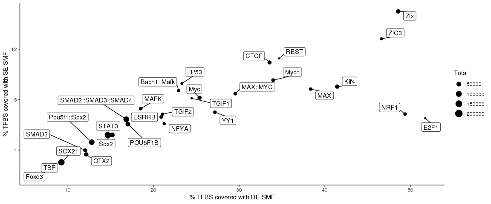

Kleinendorst\_et\_al
================
GuidoBarzaghi
18/07/2021

Fig.2

``` r
library(BSgenome.Mmusculus.UCSC.mm10)
library(tidyverse)

# Get list of ChIP confirmed JASPAR TFBSs
JASPAR_TFBSs = readRDS("/g/krebs/krebs/analysis/SMF/MM/analysis/mapped_jaspar_ChIP_annotated.rds")
JASPAR_TFBSs_ChIP = JASPAR_TFBSs[JASPAR_TFBSs$isBound == TRUE]

UpstreamBins = GRanges(seqnames(JASPAR_TFBSs_ChIP), IRanges(start = end(JASPAR_TFBSs_ChIP) - (width(JASPAR_TFBSs_ChIP)/2) - 35, end = end(JASPAR_TFBSs_ChIP) - (width(JASPAR_TFBSs_ChIP)/2) - 25))
UpstreamBinSeq = getSeq(BSgenome.Mmusculus.UCSC.mm10, UpstreamBins)
TFBSBins = GRanges(seqnames(JASPAR_TFBSs_ChIP), IRanges(start = end(JASPAR_TFBSs_ChIP) - (width(JASPAR_TFBSs_ChIP)/2) - 15, end = end(JASPAR_TFBSs_ChIP) - (width(JASPAR_TFBSs_ChIP)/2) + 15))
TFBSBinsSeq = getSeq(BSgenome.Mmusculus.UCSC.mm10, TFBSBins)
DownstreamBins = GRanges(seqnames(JASPAR_TFBSs_ChIP), IRanges(start = end(JASPAR_TFBSs_ChIP) - (width(JASPAR_TFBSs_ChIP)/2) + 25, end = end(JASPAR_TFBSs_ChIP) - (width(JASPAR_TFBSs_ChIP)/2) + 35))
DownstreamBinSeq = getSeq(BSgenome.Mmusculus.UCSC.mm10, DownstreamBins)

Covered_SE = vcountPattern(pattern = "DGCHN", subject = UpstreamBinSeq, fixed = F) > 0 & 
  vcountPattern(pattern = "DGCHN", subject = TFBSBinsSeq, fixed = F) > 0 &
  vcountPattern(pattern = "DGCHN", subject = DownstreamBinSeq, fixed = F) > 0

UpstreamCoverage = vcountPattern(pattern = "GC", subject = UpstreamBinSeq) > 0 | vcountPattern(pattern = "CG", subject = UpstreamBinSeq) > 0
TFBSCoverage = vcountPattern(pattern = "GC", subject = TFBSBinsSeq) > 0 | vcountPattern(pattern = "CG", subject = TFBSBinsSeq) > 0
DownstreamCoverage = vcountPattern(pattern = "GC", subject = DownstreamBinSeq) > 0 | vcountPattern(pattern = "CG", subject = DownstreamBinSeq) > 0
Covered_DE = UpstreamCoverage & TFBSCoverage & DownstreamCoverage

JASPAR_TFBSs_ChIP %>%
  as_tibble() %>%
  mutate(TFBS = names(JASPAR_TFBSs_ChIP)) %>%
  mutate(Covered_SE = Covered_SE, Covered_DE = Covered_DE) %>%
  select(TFBS, name, Covered_SE, Covered_DE) -> TFBS_coverage_DF

# N.b.: because I only ask for TFBSs to contain AT LEAST one cytosine, overcounting GCGs has no consequence

# TF-wise
TFBS_coverage_DF %>%
  group_by(name) %>%
  summarise(Count = sum(Covered_SE)) %>%
  mutate(ExpType = "SE SMF") -> SE_TFBSs
TFBS_coverage_DF %>%
  group_by(name) %>%
  summarise(Count = sum(Covered_DE)) %>%
  mutate(ExpType = "DE SMF") -> DE_TFBSs
TFBS_coverage_DF %>%
  group_by(name) %>%
  summarise(Count = n()) %>%
  mutate(ExpType = "Total") -> Tot_TFBSs

rbind(SE_TFBSs, DE_TFBSs, Tot_TFBSs) %>%
  spread(ExpType, Count) %>%
  gather(ExpType, nrTFBSs, -name, -Total) %>%
  mutate(perc = (nrTFBSs / Total)*100) %>%
  select(-nrTFBSs) %>%
  spread(ExpType, perc) %>%
  ggplot() +
  geom_point(aes(x=`DE SMF`, y=`SE SMF`, size=Total)) +
  ggrepel::geom_label_repel(aes(x=`DE SMF`, y=`SE SMF`, label=name), force = 3, box.padding = 0.5, max.overlaps = 15) +
  xlab("% TFBS covered with DE SMF") +
  ylab("% TFBS covered with SE SMF") +
  theme_classic()
```

<!-- -->

Fig.3

``` r
# library(SingleMoleculeFootprinting)
# library(BSgenome)
# library(tidyverse)
# 
# Qinput = "/g/krebs/barzaghi/HTS/SMF/MM/2021-05-06-000000000-JFM6H_Lambda/aln/Qinput.txt"
# LambdaGenomeSeq = readDNAStringSet(filepath = "/g/krebs/barzaghi/analyses/misc/NP_rebuttal/LambdaGenome.fasta")
# names(LambdaGenomeSeq) = "J02459.1"
# QuasRprj = QuasR::qAlign(sampleFile = Qinput, genome = "/g/krebs/barzaghi/analyses/misc/NP_rebuttal/LambdaGenome.fasta", paired = 'fr', bisulfite = "undir")
# QuasRprj@aligner = "Rbowtie"
# Methylation = QuasR::qMeth(proj = QuasRprj, mode = "allC")
# 
# GCs = FilterContextCytosines(MethGR = Methylation, genome = LambdaGenomeSeq, context = "GC")
# CGs = FilterContextCytosines(MethGR = Methylation, genome = LambdaGenomeSeq, context = "CG")
# 
# GCs_collapsed = CollapseStrands(MethGR = GCs, context = "GC")
# CGs_collapsed = CollapseStrands(MethGR = CGs, context = "CG")
# 
# GCs_filtered = CoverageFilter(MethGR = GCs_collapsed, thr = 20)
# CGs_filtered = CoverageFilter(MethGR = CGs_collapsed, thr = 20)
# 
# start(GCs_filtered) = start(GCs_filtered) - 1
# end(GCs_filtered) = end(GCs_filtered) + 2
# start(CGs_filtered) = start(CGs_filtered) - 2
# end(CGs_filtered) = end(CGs_filtered) + 1
# AllCs = c(GCs_filtered, CGs_filtered)
# 
# KMERS = getSeq(LambdaGenomeSeq, AllCs)
# AllCs$Kmer_Context = KMERS
# 
# AllCs %>%
#   as_tibble() %>%
#   filter(GenomicContext == "CG") %>%
#   select(-seqnames, -end, -strand, -width) %>%
#   gather(Measure, Value, -Kmer_Context, -GenomicContext, -start) %>%
#   separate(Measure, into = c("Sample", "Measure"), sep = "_", remove = TRUE) %>%
#   spread(Measure, Value) %>%
#   filter(str_detect(Sample, "CG")) -> EDA_DF_CGs
# AllCs %>%
#   as_tibble() %>%
#   filter(GenomicContext == "GC") %>%
#   select(-seqnames, -end, -strand, -width) %>%
#   gather(Measure, Value, -Kmer_Context, -GenomicContext, -start) %>%
#   separate(Measure, into = c("Sample", "Measure"), sep = "_", remove = TRUE) %>%
#   spread(Measure, Value)  %>%
#   filter(str_detect(Sample, "GC"))-> EDA_DF_GCs
# 
# grep("Kmer_Context|GenomicContext", sort(unique(gsub("_Coverage$|_MethRate$", "", colnames(elementMetadata(AllCs))))), invert = TRUE, value = TRUE) %>%
#   data.frame() %>%
#   rename("Sample" = ".") %>%
#   mutate(Enzyme = gsub("[[:digit:]]|R", "", Sample), Conc = gsub("[[:alpha:]]", "", Sample)) %>%
#   mutate(Concentration = c(0,0.75,10,1.5,2,3,4,
#                            0,0.2,0.7,10,1.2,1.5,2,
#                            0.2,0.7,10,1.2,1.5,2)) %>%
#   mutate(Replicate = c(rep(1, 14), rep(2, 6))) %>%
#   select(-Conc) -> SamplesDict
# 
# plyr::join(rbind(EDA_DF_CGs, EDA_DF_GCs), SamplesDict) -> Plotting_DF
# Plotting_DF %>%
#   group_by(Kmer_Context, Enzyme, Concentration) %>%
#   summarise(Median_MethRate = median(MethRate, na.rm = TRUE)) %>%
#   ungroup() -> Summarised_Plotting_DF
# 
# Summarised_Plotting_DF %>%
#   group_by(Kmer_Context, Enzyme) %>%
#   arrange((Concentration)) %>%
#   mutate(MethRate_seqDiff = c(Median_MethRate[1], diff(Median_MethRate))) %>%
#   ungroup() %>%
#   mutate(Concentration = factor(Concentration, levels = rev(unique(Concentration)))) %>%
#   ggplot() +
#   geom_bar(aes(reorder(Kmer_Context, Median_MethRate, na.rm=TRUE), MethRate_seqDiff*100, fill=Concentration), stat='identity', position = "stack") +
#   facet_wrap(~Enzyme, scales = "free_x", labeller = as_labeller(c("GC" = "M.CviPI", "CG" = "M.SssI"))) +
#   xlab("") +
#   ylab("Methylation (%)") +
#   theme_classic() +
#   labs(fill = "Concentration\n[U/\u03bcg]") +
#   theme(axis.text.x = element_text(angle=90, vjust = 0.5), text = element_text(size = 25)) +
#   scale_y_continuous(breaks = c(0,100)) +
#   scale_fill_manual(values = rev(c(RColorBrewer::brewer.pal(name = "Reds", n=9), "black")))
```

Fig.6

``` r
# library(SingleMoleculeFootprinting) # for this use the dev version https://github.com/Krebslabrep/SingleMoleculeFootprinting/tree/dev
# library(ggplot2)
# library(tidyverse)
# library(BSgenome.Mmusculus.UCSC.mm10)
# 
# Qinput = "/g/krebs/barzaghi/HTS/SMF/MM/QuasR_input_files/QuasR_input_AllCanWGpooled_dprm.txt"
# 
# MiSeq_Samples = grep("NO.*_MiSeq$", readr::read_delim(Qinput, "\t")$SampleName, value = TRUE)
# NextSeq_Sample = "SMF_MM_TKO_as_NO_R_NextSeq"
# 
# chr19 = GRanges(seqinfo(BSgenome.Mmusculus.UCSC.mm10))[19]
# 
# CallContextMethylation(sampleSheet = Qinput,
#                        sample = MiSeq_Samples,
#                        genome = BSgenome.Mmusculus.UCSC.mm10,
#                        RegionOfInterest = chr19,
#                        coverage = 1,
#                        returnSM = FALSE) -> MiSeq
# CallContextMethylation(sampleSheet = Qinput, 
#                        sample = NextSeq_Sample, 
#                        genome = BSgenome.Mmusculus.UCSC.mm10, 
#                        RegionOfInterest = chr19, 
#                        coverage = 20, 
#                        returnSM = FALSE) -> NextSeq
# 
# LowCoverageMethRateDistribution(LowCoverage = MiSeq$DGCHN, 
#                                 LowCoverage_samples = MiSeq_Samples,
#                                 HighCoverage = NextSeq$DGCHN, 
#                                 HighCoverage_samples = NextSeq_Sample, 
#                                 bins = 50, returnDF = TRUE, returnPlot = TRUE, MSE = TRUE, return_MSE_DF = TRUE, return_MSE_plot = TRUE) -> Results
# 
# Results$MethylationDistribution_plot
# Results$MSE_plot

# Results %>% 
#   distinct() %>%
#   group_by(Sample, GenomicContext, Coverage) %>%
#   mutate(ExpectedMeth = seq(1,n()*2,2)/100) %>%
#   mutate(SampleQuality = ifelse(Sample %in% c("SMF_MM_NP_NO_R3_MiSeq", "SMF_MM_NP_NO_R4_MiSeq"), "bad", "good")) %>%
#   ungroup() -> AllResults
# AllSamples = unique(AllResults$Sample)
# Bins = as.character(unique(AllResults$Bins))
# 
# LabelsDF = filter(AllResults, Sample == "asdgdagsfgh")
# for (sample in AllSamples){
#   
#   rbind(LabelsDF,
#         AllResults %>%
#           filter(Sample == sample & Bins == sample(Bins, size = 1))
#   ) %>% 
#     distinct() -> LabelsDF
#   
# }
# 
# AllResults %>%
#   mutate(`Sample quality` = SampleQuality) %>%
#   ggplot(aes(x=ExpectedMeth*100,y=Bin_MethRate*100, group=interaction(Sample,Coverage), color=`Sample quality`)) +
#   geom_line(aes(linetype=Coverage, size=Coverage)) +
#   ylab("Observed Methylation (%)") +
#   xlab("Expected Methylation (%)") +
#   theme_classic() +
#   guides(color = guide_legend(override.aes = list(size = 2)), linetype = guide_legend(override.aes = list(size = 2))) +
#   theme(text = element_text(size = 25), legend.key.width = unit(17, "mm")) +
#   scale_x_continuous(breaks = c(0,100)) +
#   scale_y_continuous(breaks = c(0,100)) +
#   scale_size_manual("type", values = c(2.5, 1), guide = "none") -> pl1
# 
# RMSE_DF = data.frame(Sample = c(), MSE = c())
# for (sample in seq_along(AllSamples)){
#   
#   x = filter(AllResults, Sample == AllSamples[sample])$ExpectedMeth
#   y = filter(AllResults, Sample == AllSamples[sample])$Bin_MethRate
#   
#   RMSE_DF = rbind(RMSE_DF, data.frame(Sample = AllSamples[sample], MSE = (mean((y - x) ** 2))))
#   
# }
# 
# RMSE_DF %>%
#   filter(Sample %in% grep("emb|S2|III|IV", AllSamples, value = TRUE, invert = TRUE)) %>%
#   mutate(`Sample quality` = ifelse(Sample %in% c("SMF_MM_NP_NO_R3_MiSeq", "SMF_MM_NP_NO_R4_MiSeq", "SMF_as_NO_emb2.4_classic", "SMF_as_NO_emb2.4_HBuffer",
#                                               "SMF_as_NO_emb2.4.fixed", "SMF_as_NO_emb2.4.unfixed", "SMF_as_NO_S2_CaCl2_20L10T"), "bad", "good")) %>%
#   filter(Sample != "SMF_MM_TKO_as_NO_R_NextSeq") %>%
#   mutate(Sample = gsub("_", " ", 
#                        gsub("NP", "Neural_progenitor", 
#                             gsub("ES", "mESC", 
#                                  gsub("_MiSeq$|_NO|SMF_|MM_", "", Sample))))) %>%
# ggplot(aes(Sample, MSE, fill=`Sample quality`)) +
#   geom_bar(stat = 'identity') +
#   ylab("Mean squared error\n(MSE)") +
#   xlab("") +
#   theme_classic() +
#   scale_y_continuous(breaks = c(0, 0.06)) +
#   theme(axis.text.x = element_text(angle = 90, vjust = 0.5), text = element_text(size = 25)) -> pl2
# 
# cowplot::plot_grid(pl1, pl2, nrow = 1, align = "none")
```

Fig.7
